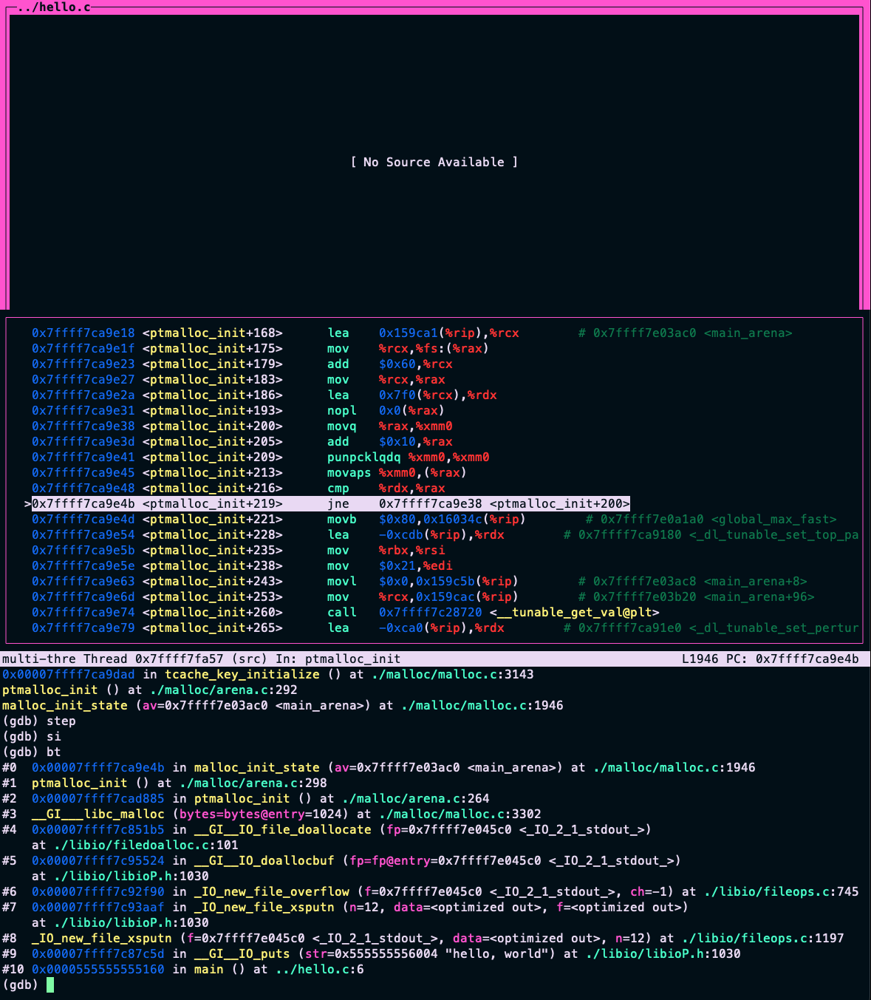
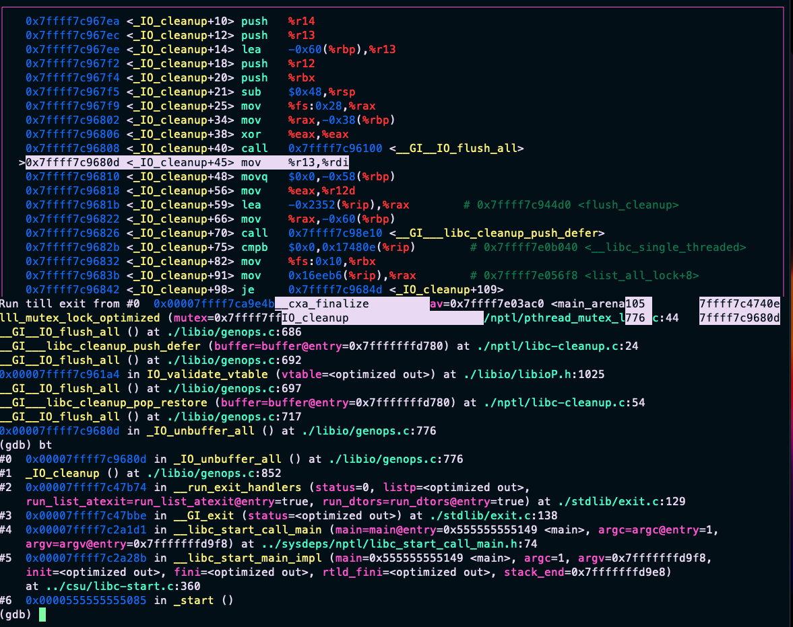

# my_intro 实验笔记：从 hello world 理解编译、链接与运行时

本实验以一个最小 C 程序为对象，观察它从源码到可执行文件，再到运行时执行路径的完整过程：

```c
#include <stdio.h>

int main()
{
    printf("hello, world\n");
    return 0;
}
```

这个程序本身很短，但经过预处理、编译、汇编、链接和运行时加载之后，会涉及编译器、链接器、动态链接器、libc 和 Linux 内核等多个层次。实验主要围绕以下问题展开：

- 为什么 `hello.c` 只有几行，预处理后的 `hello.i` 却这么大？
- 为什么源码里写的是 `printf`，汇编里却变成了 `puts`？
- 为什么 `hello.o` 不能直接运行，非要链接成 `hello`？
- 为什么 GDB 单步执行时，会进入 libc、malloc、动态链接器内部？
- 为什么 `main` 已经 `return 0` 了，程序还在继续跑退出清理逻辑？

以下内容按这些问题组织。

实验目录中的主要文件如下：

- `hello.c`：最原始的 C 源码
- `hello.i`：预处理后的 C 文件
- `hello.s`：编译器生成的汇编文件
- `hello.o`：汇编器生成的可重定位目标文件
- `hello`：最终链接出来的可执行文件
- `hello_unlink.s`：对 `hello.o` 的反汇编
- `hello_link.s`：对最终可执行文件 `hello` 的反汇编

实验截图：



GDB 中观察 `return` 之后 libc 退出清理路径的截图：



## 1. 编译流程并不是简单更改后缀名

Makefile 将整个过程拆成四步：

```make
hello.i: hello.c
	gcc -Wall -Og -m64 -E hello.c -o hello.i

hello.s: hello.i
	gcc -Wall -Og -m64 -S hello.i -o hello.s

hello.o: hello.s
	gcc -Wall -Og -m64 -c hello.s -o hello.o

hello: hello.o
	gcc -Wall -Og -m64 -o hello hello.o
```

对应关系是：

```text
hello.c
  -> 预处理
hello.i
  -> 编译
hello.s
  -> 汇编
hello.o
  -> 链接
hello
```

这几步并不是简单地把文件后缀从 `.c` 改成 `.i`、`.s`、`.o`。每一步都在解决不同的问题：

- 预处理：把“带 `#include`、宏、条件编译的 C 文本”整理成更完整的 C 文本。
- 编译：把 C 语言逻辑翻译成某个 CPU 架构能理解的汇编文本。
- 汇编：把汇编文本变成机器码，放进目标文件。
- 链接：把当前目标文件和外部库、启动代码接起来，生成能运行的 ELF 文件。

核心结论是：`hello.c` 是面向程序员的源代码，`hello` 是操作系统能够加载运行的可执行文件，中间文件记录了两者之间逐步转换的结果。

## 2. 为什么 `hello.i` 会比 `hello.c` 大这么多

预处理命令是：

```bash
gcc -E hello.c -o hello.i
```

源码中只有一句：

```c
#include <stdio.h>
```

这条预处理指令并不是只让编译器“知道存在 stdio”，而是要求预处理器把 `stdio.h` 的内容展开进来。`stdio.h` 自身还会继续包含其他系统头文件，因此最终生成的 `hello.i` 会明显大于原始源码。

预处理器主要做这些事：

- 展开 `#include`
- 展开宏
- 处理 `#if`、`#ifdef`、`#ifndef`
- 删除注释
- 插入行号标记，方便后面报错和生成调试信息

因此，`hello.i` 仍然是 C 语言文本，只是它已经包含了大量来自头文件的声明和类型定义。

### 2.1 `hello.i` 里那些 `# 1` 是地址吗

不是。

`hello.i` 里会看到类似这样的内容：

```c
# 1 "/usr/include/stdio.h" 1 3 4
# 214 "/usr/lib/gcc/x86_64-linux-gnu/13/include/stddef.h" 3 4
# 3 "hello.c" 2
```

它们不是内存地址，也不是汇编标签，而是预处理器留下的源码来源标记。

比如：

```c
# 1 "/usr/include/stdio.h" 1 3 4
```

其含义是：接下来的内容来自 `/usr/include/stdio.h` 的第 1 行。后面的数字是给编译器使用的标记，例如进入新文件、该文件属于系统头文件等。

这些标记的作用是保留源码位置。预处理之后，多个头文件的内容被展开到同一个 `hello.i` 文件中。没有这些标记，编译器后续报错时就很难指出错误原本来自 `hello.c`，还是来自某个头文件。

### 2.2 为什么头文件里有很多 `typedef` 和 `struct`

在 `hello.i` 里会看到很多类型定义，例如：

```c
typedef long unsigned int size_t;
```

`typedef` 的作用就是给已有类型起一个新名字。所以下面两种写法意思接近：

```c
size_t n;
long unsigned int n;
```

使用 `size_t` 而不是直接写 `long unsigned int`，主要是为了表达语义并隐藏平台差异。不同平台上，同一个概念可能需要不同宽度的整数类型。`size_t` 表示“对象大小或长度”，具体底层对应哪种无符号整数类型，由系统头文件决定。

还会看到类似 `struct _IO_FILE` 的东西：

```c
struct _IO_FILE
{
    int _flags;
    char *_IO_read_ptr;
    char *_IO_read_end;
    ...
};
```

这与常见的 `FILE *fp` 有关。`FILE` 不是凭空出现的类型，它背后和 glibc 的 `struct _IO_FILE` 有联系。也就是说，`stdio.h` 不只是声明 `printf`，还需要把标准输入输出相关的类型、常量、函数原型提供给编译器。

这里容易误解的一点是：头文件中出现了很多结构体和函数声明，并不代表这些内容都会变成当前程序里的机器指令。声明只是让编译器知道“有哪些符号、类型长什么样、函数应该如何调用”。真正的函数实现通常位于 libc 等库文件中。

## 3. 为什么 `printf` 到汇编里变成了 `puts`

编译命令是：

```bash
gcc -S hello.i -o hello.s
```

`hello.s` 是编译器生成的汇编文本。当前核心部分是：

```asm
.LC0:
    .string "hello, world"

.globl  main
.type   main, @function
main:
.LFB23:
    .cfi_startproc
    endbr64
    subq    $8, %rsp
    leaq    .LC0(%rip), %rdi
    call    puts@PLT
    movl    $0, %eax
    addq    $8, %rsp
    ret
    .cfi_endproc
.LFE23:
```

一个直接的问题是：源码中写的是 `printf("hello, world\n")`，为什么汇编中出现的是 `call puts@PLT`？

原因是编译器发现这个 `printf` 没有格式化参数。

如果写的是：

```c
printf("x = %d\n", x);
```

此时 `printf` 必须解析格式字符串，处理 `%d`，并把参数格式化成文本。

但这里是：

```c
printf("hello, world\n");
```

没有 `%d`、`%s` 之类的占位符。它的效果等价于：

```c
puts("hello, world");
```

`puts` 自己会补一个换行，所以汇编里的字符串也从：

```text
hello, world\n
```

变成了：

```text
hello, world
```

这是一个直观的编译器优化：在语义等价的前提下，编译器可以用更简单的函数调用替代源代码中的原始调用形式。

## 4. `.LC0`、`%rdi`、`main:` 分别表示什么

先看字符串：

```asm
.LC0:
    .string "hello, world"
```

`.LC0` 是编译器生成的本地标签，用来标记字符串常量的位置。后面这条指令会使用它：

```asm
leaq .LC0(%rip), %rdi
```

这条指令的作用是把字符串地址放进 `%rdi`。

为什么是 `%rdi`？

因为在 x86-64 Linux 的函数调用约定里，第一个函数参数放在 `%rdi`。因此，这条指令是在准备：

```c
puts("hello, world");
```

再看 `main`：

```asm
.globl main
.type main, @function
main:
```

这几行告诉汇编器和链接器：

- `main` 是一个全局符号，链接器能找到它。
- `main` 的类型是函数。
- `main:` 这里就是函数入口。

函数最后的：

```asm
movl    $0, %eax
addq    $8, %rsp
ret
```

含义是：把返回值 `0` 放进 `%eax`，恢复栈，然后返回调用者。

## 5. `.LFB23`、`.LFE23` 和数字标签是不是业务逻辑

汇编里还有一些看起来比较陌生的标签：

```asm
.LFB23:
...
.LFE23:
```

它们是 GCC 生成的本地标签，通常和函数范围、调试信息、栈展开信息有关，不属于程序的核心逻辑。

文件末尾还可能看到：

```asm
0:
    .string "GNU"
1:
    .align 8
    .long 0xc0000002
    .long 3f - 2f
2:
    .long 0x3
3:
    .align 8
4:
```

这里的 `0:`、`1:`、`2:` 是汇编里的数字局部标签，常用于临时计算位置或长度。

例如：

```asm
.long 3f - 2f
```

含义是写入一个 4 字节整数，值等于“向前找到的 `3:` 地址”减去“向前找到的 `2:` 地址”。

其中：

- `f` 表示 forward，往后找。
- `b` 表示 backward，往前找。

这部分通常出现在 `.note.gnu.property` 之类的段中，用来记录 ELF/GNU 属性，例如某些平台安全特性。它不是 `main` 的核心逻辑。

## 6. 为什么 `hello.o` 还不能直接运行

汇编命令是：

```bash
gcc -c hello.s -o hello.o
```

这一步把汇编文本变成机器码，生成 `hello.o`。但 `hello.o` 还是“可重定位目标文件”，它不是完整程序。

原因是其中还有一些内容没有最终确定。比如 `puts` 的实现不在 `hello.o` 中，而在 libc 中。此时 `hello.o` 只能表达：

```text
这里需要调用一个名为 puts 的外部函数。
```

但它还不知道运行时应该跳转到哪个具体地址。

观察 `hello_unlink.s` 可以看到这一点：

```asm
0000000000000000 <main>:
   0:  f3 0f 1e fa           endbr64
   4:  48 83 ec 08           sub    $0x8,%rsp
   8:  48 8d 3d 00 00 00 00  lea    0x0(%rip),%rdi
   f:  e8 00 00 00 00        call   ...
```

这里很多位置仍然是 `0`，因为链接器还没有填入最终地址。

因此，`hello.o` 是一个尚未完成链接的目标文件：自身的一部分机器码已经生成，但外部依赖还没有解析完成。

## 7. 链接补充了什么

链接命令是：

```bash
gcc -o hello hello.o
```

链接器会把以下内容组织到一起：

- 当前程序生成的 `hello.o`
- C 程序启动相关代码
- 动态链接需要的表和信息
- 对 libc 等动态库的依赖
- 符号和重定位信息

最终得到的 `hello` 是一个 ELF 可执行文件，大致信息是：

```text
ELF 64-bit LSB pie executable, x86-64, dynamically linked
```

它依赖：

```text
linux-vdso.so.1
libc.so.6
/lib64/ld-linux-x86-64.so.2
```

这些依赖可以这样理解：

- `libc.so.6`：C 标准库，`puts`、`printf`、`malloc`、`exit` 等都在这里。
- `/lib64/ld-linux-x86-64.so.2`：动态链接器，程序启动时由它负责加载动态库、解析符号。
- `linux-vdso.so.1`：内核映射到用户态的一小段代码，用来加速某些系统调用相关功能。

链接后，在 `hello_link.s` 里能看到：

```asm
0000000000001060 <_start>:
...
call *__libc_start_main@GLIBC_2.34

0000000000001050 <puts@plt>:
...

0000000000001149 <main>:
...
call puts@plt
```

此时程序已经不只包含 `main`。它还包含 `_start`、PLT、动态链接相关结构等内容。

## 8. 为什么程序不是从 `main` 直接开始

编写 C 程序时，通常会把 `main` 当成入口。但从操作系统和 ELF 的角度看，真正的入口通常不是 `main`，而是 `_start`。

流程可以概括为：

```text
操作系统加载 ELF
  -> 动态链接器加载 libc 等动态库
  -> 跳到可执行文件入口 _start
  -> _start 调用 __libc_start_main
  -> __libc_start_main 做运行时初始化
  -> 调用用户写的 main
```

在 `hello_link.s` 中可以看到 `_start` 会把 `main` 的地址交给 `__libc_start_main`：

```asm
0000000000001060 <_start>:
    ...
    lea    0xca(%rip),%rdi        # main
    call   *__libc_start_main@GLIBC_2.34
```

更准确地说：

```text
操作系统不直接调用 main。
main 是被 libc 启动代码调用的。
```

这样设计是因为运行 `main` 前后还有许多准备工作，例如初始化 libc、处理参数和环境变量、准备标准输入输出、注册退出清理逻辑等。

## 9. 为什么 GDB 会进入 libc、malloc、动态链接器

`hello_link.s` 是用这个命令生成的：

```bash
objdump -d hello > hello_link.s
```

它反汇编的是最终可执行文件 `hello` 本身。它能看到 `_start`、`main`、`puts@plt`，但不会展示整个 `libc.so.6` 和动态链接器内部的完整代码。

而 GDB 调试的是运行中的真实进程。

因此，当 GDB 中使用：

```gdb
si
```

遇到：

```asm
call puts@PLT
```

GDB 会进入 `puts` 的真实调用路径。`puts` 不只是一个符号名称，它背后会经过 libc 的 stdio 逻辑，可能触发缓冲区初始化、locale、动态链接解析，甚至 malloc 相关初始化。

因此看到这些函数是正常的：

```text
puts
stdio 初始化
malloc 初始化
malloc_init_state
动态链接器内部逻辑
```

这不是程序执行异常，也不是死循环，而是 `si` 选择了进入函数调用内部。

如果只关注当前程序的 `main`，应更多使用：

```gdb
nexti
```

区别是：

- `si` / `stepi`：单步执行，并进入函数调用内部。
- `nexti`：执行下一条汇编指令；如果这条指令是 `call`，则把调用整体执行完，不进入被调用函数内部。

## 10. 为什么没有写 `malloc`，却看到了 `malloc_init_state`

GDB 中出现过：

```text
malloc_init_state (av=0x7ffff7e03ac0 <main_arena>) at ./malloc/malloc.c:1946
```

这里的问题是：源码中没有显式调用 `malloc`，为什么 GDB 会进入 `malloc_init_state`？

原因是“用户代码没有显式调用”不等于“运行时不会使用”。这个程序虽然只有一行输出，但 libc 的内部实现可能需要初始化一些状态。例如：

- stdio 可能需要缓冲区。
- locale 相关逻辑可能需要内部数据。
- 动态链接器解析符号时可能需要运行时结构。
- libc 的堆管理器需要初始化主 arena。

`main_arena` 是 glibc `malloc` 管理堆内存时使用的主 arena。看到 `malloc_init_state`，说明执行路径已经从当前程序进入了 libc 的内部实现。

这里的重点不是理解 malloc 源码的每一行，而是区分用户代码与运行时系统的边界：

```text
用户代码很短，但运行时系统并不简单。
```

GDB 观察到的是完整运行路径，因此会比源代码本身复杂得多。

## 11. 为什么 `return 0` 后程序还没立刻结束

截图中可以看到，`main` 执行完 `return 0` 之后，又进入了一系列 libc 内部函数：


```text
_start
__libc_start_main_impl
__libc_start_call_main
__GI_exit
__run_exit_handlers
_IO_cleanup
_IO_unbuffer_all
_GI__IO_flush_all
_GI__IO_cleanup_push_defer
```

这说明：

```text
return 0 只是 main 函数返回，并不表示整个进程立即结束。
```

`main` 返回之后，控制权会回到 libc 的启动框架。libc 会把 `main` 的返回值交给退出流程：

```text
main 返回 0
  -> 回到 __libc_start_call_main / __libc_start_main_impl
  -> libc 调用 exit
  -> exit 执行退出清理
  -> flush stdio 缓冲区
  -> 执行 atexit 注册的函数
  -> 执行全局析构和动态库析构
  -> 调用 exit_group(0) 结束进程
```

从 C 语言语义上看，在 `main` 中：

```c
return 0;
```

其效果接近：

```c
exit(0);
```

这并不表示编译器一定会在 `main` 中生成 `call exit`，而是运行时会接收 `main` 的返回值，并按照正常退出规则处理。

### 11.1 `_IO_cleanup` 和 `_IO_flush_all` 在清什么

这些函数和 glibc 的 stdio 系统有关，也就是 `printf`、`puts`、`FILE *`、`stdout` 等标准输入输出机制。

C 标准库的输出通常是带缓冲的。比如：

```c
printf("some buffered text");
return 0;
```

这段代码没有换行，内容可能先保留在用户态的 `stdout` 缓冲区中。如果程序退出时不清理缓冲区，输出就可能丢失。

因此，正常退出时，libc 需要执行类似以下操作：

```text
检查所有打开的 FILE 流
  -> 把还没写出去的数据 flush 到内核
  -> 整理 stdio 内部结构
  -> 清理缓冲状态
```

这就是 `_IO_cleanup`、`_IO_flush_all`、`_IO_unbuffer_all` 等函数存在的原因。

### 11.2 `__run_exit_handlers` 在处理什么

`__run_exit_handlers` 是退出清理的统一入口之一。它可能处理：

- `atexit(...)` 注册的函数
- C++ 全局对象析构函数
- 动态库卸载时的析构函数
- libc 自己注册的清理逻辑
- stdio flush 和 cleanup

这个 hello world 没有手动注册 `atexit`，但 libc 和动态链接器仍然可能有自己的清理动作。

因此，GDB 中看到多层调用不是异常，而是正常退出路径。

## 12. libc 在这里负责什么

在本实验中，libc 至少负责几类工作：

- 提供 `puts`、`printf`、`exit` 等 C 标准库函数。
- 提供程序启动逻辑，比如 `__libc_start_main`。
- 管理 stdio 缓冲，比如 `stdout`、`FILE *`。
- 包装系统调用，比如 `write`、`open`、`mmap`。
- 处理退出清理，比如 flush 输出、执行析构函数。
- 支持运行时能力，比如 malloc、locale、线程本地存储等。

这些工作没有交给每个程序单独实现，是因为它们复杂、平台相关，而且几乎所有 C 程序都需要。将其放在 libc 中有几个好处：

- 复用：每个程序不用自己实现 `printf`、`malloc`。
- 可移植：程序员写标准 C 接口，libc 负责对接 Linux 系统调用。
- 共享：动态链接时，很多程序可以共享同一份 libc 代码。
- 维护：安全修复和性能优化可以集中在 libc 里完成。

这也是一个 hello world 的真实运行路径会明显长于源码的原因。源码很短，是因为许多复杂度被 libc 和操作系统承担了。

## 13. strace 看到的是哪一层

GDB 适合看函数调用和指令。`strace` 适合看程序什么时候进入内核，也就是系统调用。

用 `strace` 运行程序，可以看到类似：

```text
execve("/home/kunxiang/Desktop/Dev/code/intro/my_intro/hello", ...) = 0
openat(AT_FDCWD, "/etc/ld.so.cache", O_RDONLY|O_CLOEXEC) = 3
openat(AT_FDCWD, "/lib/x86_64-linux-gnu/libc.so.6", O_RDONLY|O_CLOEXEC) = 3
mmap(... libc ...) = ...
arch_prctl(ARCH_SET_FS, ...) = 0
mprotect(...) = 0
brk(NULL) = ...
brk(...) = ...
write(1, "hello, world\n", 13) = 13
exit_group(0) = ?
```

这些系统调用大致对应：

- `execve`：启动当前程序，把 ELF 文件加载为一个新进程映像。
- `openat`：打开动态链接器需要的文件，比如 `/etc/ld.so.cache` 和 `libc.so.6`。
- `mmap`：把 libc 的代码段、数据段映射进进程地址空间。
- `mprotect`：调整内存页权限，比如只读、可执行、不可写。
- `arch_prctl`：设置 x86-64 架构相关状态，比如线程本地存储 FS 基址。
- `brk`：调整堆顶，给 malloc 或运行时分配内存使用。
- `write`：真正向标准输出写入 `"hello, world\n"`。
- `exit_group`：结束整个进程。

因此，从源码到系统调用，输出路径可以概括为：

```text
printf("hello, world\n")
  -> 编译器优化成 puts("hello, world")
  -> libc 的 stdio 逻辑
  -> write(1, "hello, world\n", 13)
  -> 终端显示文本
```

其中 `1` 是标准输出文件描述符。

## 14. GDB 调试建议

如果目标是看自己的 `main`，可以这样开始：

```gdb
gdb ./hello
break main
run
layout split
display/i $pc
nexti
```

如果要观察参数如何传给 `puts`：

```gdb
info registers rdi rip rsp rax
x/s $rdi
```

在执行完这条指令之后：

```asm
leaq .LC0(%rip), %rdi
```

再看：

```gdb
x/s $rdi
```

应能看到：

```text
"hello, world"
```

如果进入了 libc 内部：

```gdb
bt
finish
continue
```

这些命令的用途是：

- `bt`：看当前调用栈，确认自己在哪里。
- `finish`：执行到当前函数返回。
- `continue`：继续运行到下一个断点或程序结束。

调试时可以遵循以下原则：

```text
只关注当前程序的指令时，优先使用 nexti。
需要研究库函数内部时，再使用 si。
不确定当前位置时，先使用 bt 查看调用栈。
```

## 15. libc、kernel 与其他语言运行时的关系

前面的实验容易引出几个边界问题：libc 是否属于操作系统？它和编译器是什么关系？头文件为什么不直接放进 `libc.so`？Python、Java 程序是否也会经过 libc？这些问题可以统一放在“用户态库、编译器、内核”的层次关系中理解。

### 15.1 libc 是操作系统的一部分吗

从系统使用者的角度看，libc 可以宽泛地看作操作系统用户态运行环境的一部分。以常见 Linux 发行版为例，glibc 通常随系统安装，许多用户态程序都会依赖它。

但从技术边界看，libc 不是 Linux 内核的一部分。它运行在用户态，和普通程序一样不能直接操作硬件，也不能直接管理进程调度、页表、文件系统驱动等内核资源。更准确的层次是：

```text
用户程序
  -> libc
  -> syscall
  -> Linux kernel
```

因此，libc 是操作系统用户态环境中的基础库，而不是内核代码。

### 15.2 libc 是 C 编译器自带的吗

libc 通常也不是 C 编译器本体的一部分。GCC 或 Clang 负责把 C 源码编译成汇编、目标文件，并在默认配置下帮助程序链接到系统提供的 libc。

在 Linux 上，一个常见组合是：

```text
GCC / Clang：编译器
glibc：C 标准库和用户态运行时库
Linux kernel：内核
```

由于 GCC 默认会链接 libc，使用者容易感觉 libc 是编译器自带的。但严格说，编译器和 libc 是不同组件，只是在构建普通 C 程序时经常配合使用。

### 15.3 头文件为什么不直接放进 `libc.so`

头文件和 `libc.so` 通常来自同一个 libc 项目，但它们服务于不同阶段。

头文件是编译阶段使用的“接口说明”。例如 `stdio.h` 会告诉编译器：

```c
int printf(const char *format, ...);
typedef struct _IO_FILE FILE;
```

这些声明说明有哪些函数、参数如何传递、有哪些类型。编译器需要这些信息来检查代码并生成正确的调用约定。

`libc.so.6` 则是运行阶段使用的“函数实现”。其中包含 `printf`、`puts`、`malloc`、`exit` 等函数的真实机器码。

因此它们通常分开放置：

```text
/usr/include/stdio.h        编译时使用
/lib/.../libc.so.6          运行时使用
```

这也是为什么 `hello.i` 中能看到大量头文件内容，但最终程序运行时仍然需要动态链接 libc：前者提供声明，后者提供实现。

### 15.4 `printf`、syscall 和 kernel 的边界

可以把 `printf` 的执行路径理解为：

```text
用户 C 代码
  -> libc 中的 printf
  -> libc 的格式化和 stdio 缓冲逻辑
  -> write 系统调用
  -> Linux kernel
  -> 终端、文件或管道
```

libc 负责 `printf` 的用户态实现，例如解析格式字符串、处理 `%d` 和 `%s`、管理 `stdout` 缓冲区，并在需要时调用 `write` 这类系统调用。

进入系统调用之后，控制权转入内核。内核负责根据文件描述符找到对应的终端、文件或管道，并完成真正的资源管理和 I/O 操作。也就是说，libc 负责系统调用之前的用户态封装，内核负责系统调用之后的内核态执行。

### 15.5 kernel 也是 C 写的吗

Linux kernel 的主要代码使用 C 编写，也包含少量汇编。汇编通常用于系统启动早期、中断和异常入口、系统调用入口、上下文切换、特殊寄存器访问等 C 语言不方便直接表达的底层位置。近年来，Linux kernel 也开始引入少量 Rust 代码。

需要注意的是，内核虽然主要由 C 写成，但它不是普通 C 程序。普通 C 程序运行在用户态，通常依赖 libc；Linux kernel 运行在内核态，不能依赖 glibc。它有自己的内部接口，例如：

```c
printk(...);   // 内核日志输出
kmalloc(...);  // 内核内存分配
```

因此，内核可以用 C 编写，但它并不运行在 libc 之上。

### 15.6 Python 和 Java 程序是否也会经过 libc

Python 和 Java 程序也经常会间接经过 libc，但路径和 C 程序不同。

运行 Python 脚本时，Linux 实际启动的是 `python` 解释器进程。这个解释器通常由 C 编写，并会依赖 libc。调用 `input()`、打开文件、申请内存、输出文本时，解释器内部可能经过 libc，再通过系统调用进入内核。

路径可以概括为：

```text
Python 代码
  -> Python 解释器
  -> libc 或解释器的 native 层
  -> syscall
  -> Linux kernel
```

Java 也类似。Linux 启动的是 JVM，JVM 本身大量由 C/C++ 编写。`System.out.println(...)` 最终也需要通过 JVM 的 native 层、libc 或更底层接口进入内核。

所以 libc 并不只服务于 C 源码。更准确地说，libc 服务于 Linux 用户态程序，尤其是 C/C++ 程序以及许多由 C/C++ 实现的语言运行时。

### 15.7 Windows 是否也有 libc

Windows 的分层方式与 Linux 不完全相同，但也有相似的结构。Windows 底层主要由 C/C++ 编写，也包含少量汇编。

Linux 上常见路径是：

```text
用户程序
  -> glibc / libc
  -> syscall
  -> Linux kernel
```

Windows 上更常见的路径是：

```text
用户程序
  -> C Runtime 或 Win32 API
  -> ntdll.dll
  -> syscall
  -> Windows NT kernel
```

如果在 Windows 上写 C，`printf`、`malloc`、`fopen` 等函数通常由 Microsoft C Runtime 提供，例如 `ucrtbase.dll`、`vcruntime*.dll` 等。它们可以看作 Windows 环境中的 C 标准库实现。

但 Windows 的主要系统 API 体系不是 POSIX libc，而是 Win32 API，例如 `CreateFile`、`ReadFile`、`WriteFile`、`CreateProcess`、`VirtualAlloc` 等。这些 API 通常位于 `kernel32.dll`、`user32.dll`、`gdi32.dll`、`advapi32.dll` 等用户态 DLL 中，再进一步通过 `ntdll.dll` 进入 Windows NT 内核。

因此，Windows 也有 C Runtime，但它不是 Windows 系统 API 的中心；Windows 更核心的用户态接口是 Win32/NT API。

## 16. 最后把整条线串起来

这个实验的重点不是记住每个文件后缀，而是理解一个小型 C 程序如何逐步连接到操作系统运行环境。

`hello.c` 是源代码。`hello.i` 展开了头文件和宏，因此体积明显变大。`hello.s` 是编译器为当前程序逻辑生成的汇编代码，因此核心部分反而很短，并且把 `printf("hello, world\n")` 优化成了 `puts("hello, world")`。

`hello.o` 已经有机器码，但外部符号还没完全解决，所以不能直接运行。链接后的 `hello` 才是 ELF 可执行文件，它有 `_start`、PLT、动态链接信息，并且依赖 libc 和动态链接器。

运行时也不是直接进入 `main`。程序先经过动态链接器和 libc 启动代码，再进入 `main`。`main` 调用 `puts` 后，输出最终通过内核的 `write` 系统调用完成。`main` 返回后，libc 还要执行退出清理，例如 flush `stdout`、执行退出回调，最后通过 `exit_group(0)` 让内核结束进程。

因此，这个 hello world 实际上回答了一个更大的问题：

```text
一行 C 代码如何在 Linux 上变成一个真实运行的进程？
```

答案不是某一个工具单独完成的，而是编译器、汇编器、链接器、动态链接器、libc 和内核共同完成的。
